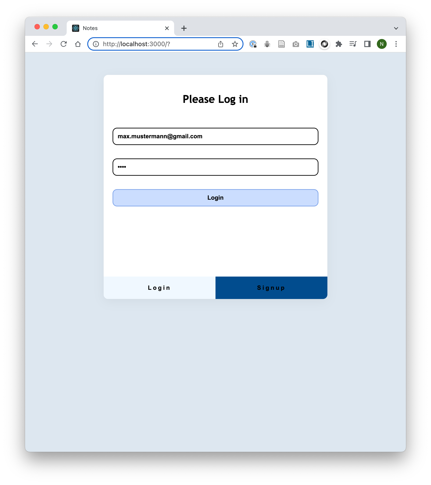
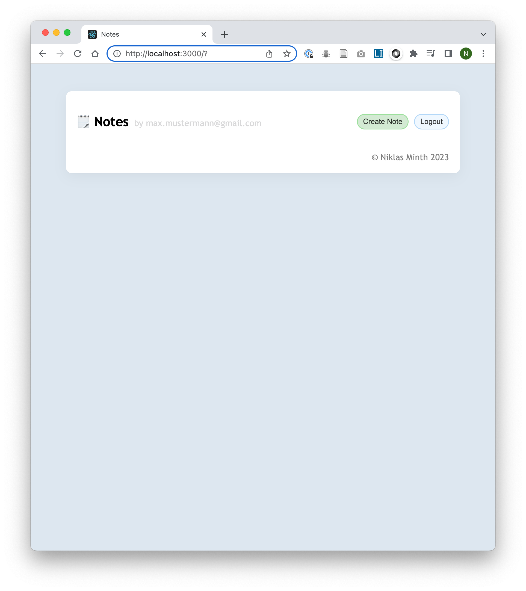
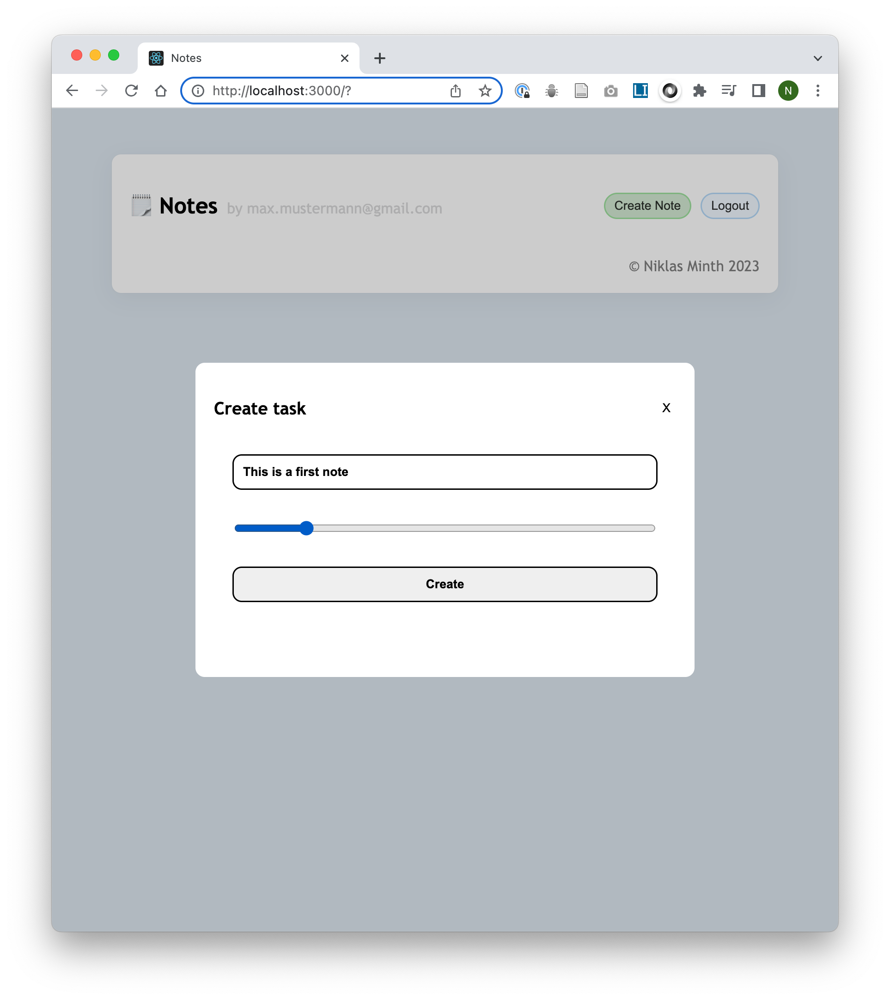
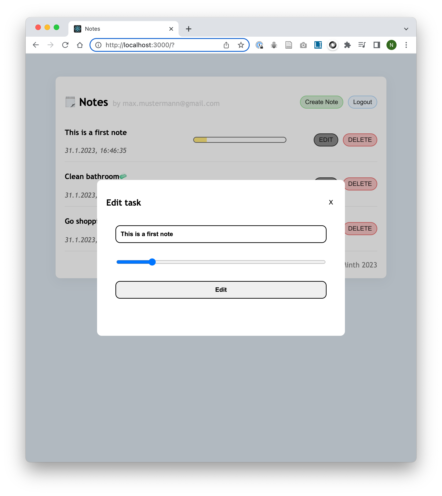
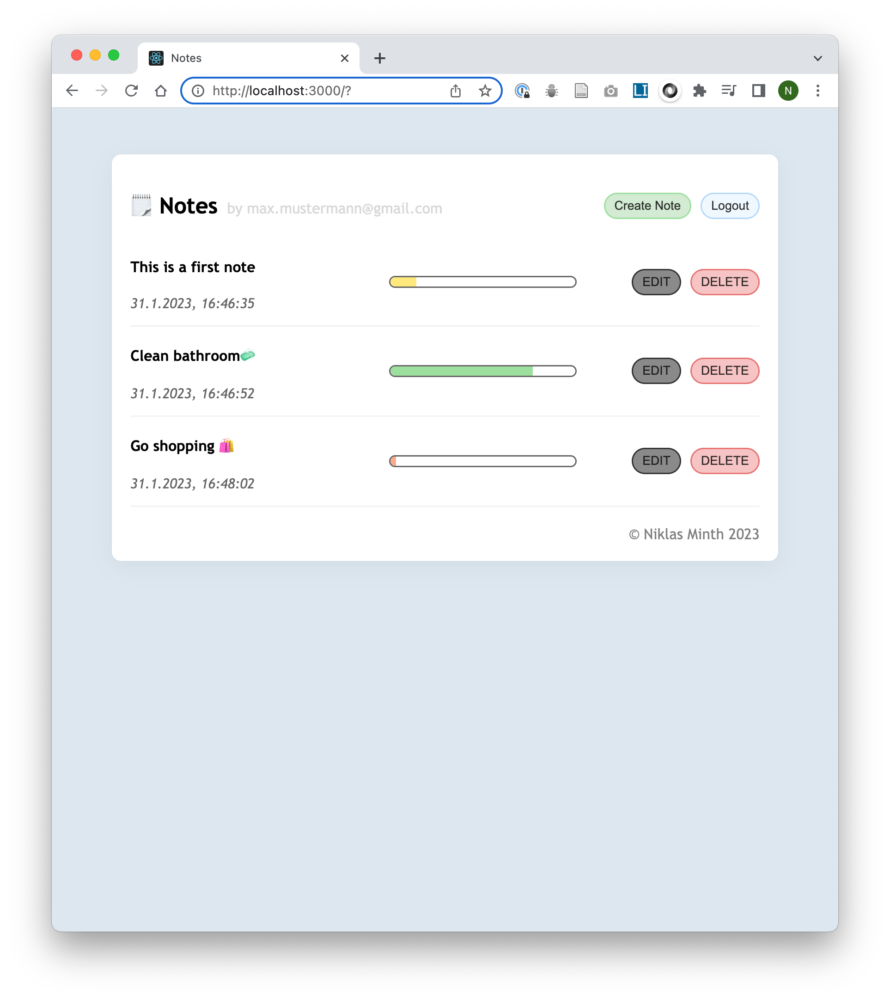

# Notizen App

## Implementation
* Frontend with React JS
* Authentication uses Cookies, Passwords are encrypted with bcrypt and a json webtoken is stored in the cookies
* Backend with nodejs
* databse: PostgreSQL
* deployed to Railway.app

## Online <a href='https://niklas1531-notes.up.railway.app/' target='_blank'>Here</a>

